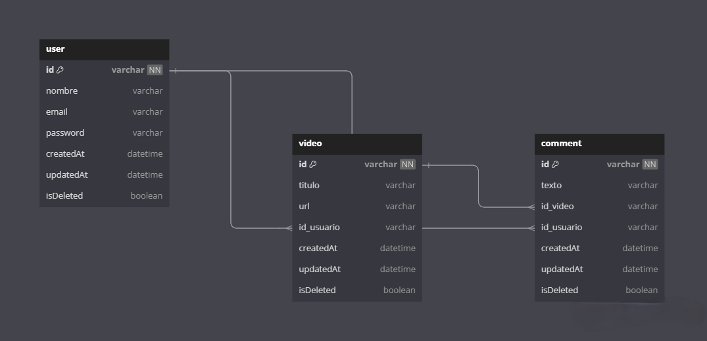

<p align="center">
  <a href="http://nestjs.com/" target="blank"></a>
</p>

[circleci-image]: https://img.shields.io/circleci/build/github/nestjs/nest/master?token=abc123def456
[circleci-url]: https://circleci.com/gh/nestjs/nest

<p align="center">A progressive <a href="http://nodejs.org" target="_blank">Node.js</a> framework for building efficient and scalable server-side applications.</p>
<p align="center">
<a href="https://www.npmjs.com/~nestjscore" target="_blank"></a>
<a href="https://www.npmjs.com/~nestjscore" target="_blank"></a>
<a href="https://www.npmjs.com/~nestjscore" target="_blank"></a>
<a href="https://circleci.com/gh/nestjs/nest" target="_blank"></a>
<a href="https://coveralls.io/github/nestjs/nest?branch=master" target="_blank"></a>


## Descripción

Este es un proyecto basado en [Nest](https://github.com/nestjs/nest) que permite a los usuarios realizar comentarios en los vídeos publicados por otros usuarios. Este proyecto se realizo con el fin de darle solucion a una problematica planteada en una prueba tecnica.

### Versiones utilizadas

-   **Node.js**: v20.14.0
-   **NestJS**: v10.4.5
-   **TypeScript**: v5.1.3
-   **Sqlite**: v5.1.7
-   **Jest**: v29.5.2
-   **TypeORM**: v10.0.2

## Si no tienes instalado Node.js, NestJS y TypeScript, puedes seguir los pasos de la siguiente [documentación](Environment-Settings.MD)

## Configuración del Proyecto

```bash
$ npm install
```

## Compilar y ejecutar el proyecto

```bash
# desarrollo
$ npm run start

# modo watch
$ npm run start:dev

# modo de producción
$ npm run start:prod
```

## Ejecutar pruebas

```bash
# pruebas unitarias
$ npm run test

# cobertura de pruebas
$ npm run test:cov
```

## Estructura de la Base de Datos

Las entidades involucradas en esta funcionalidad son:

-   **User**:

    -   `id`: Identificador único del usuario (PK).
    -   `name`: Nombre del usuario.
    -   `email`: Correo electrónico del usuario.
    -   `password`: Contraseña del usuario.
    -   `createdAt`: Fecha y hora de creación del usuario.
    -   `updatedAt`: Fecha y hora de la última actualización del usuario.
    -   `isDeleted`: Indica si el usuario ha sido eliminado.
    -   `videos`: Relación con los vídeos publicados por el usuario.
    -   `comments`: Relación con los comentarios realizados por el usuario.

-   **Video**:

    -   `id`: Identificador único del vídeo (PK).
    -   `title`: Título del vídeo.
    -   `description`: Descripción del vídeo.
    -   `id_usuario`: Identificador del usuario que publicó el vídeo (FK).
    -   `createdAt`: Fecha y hora de creación del vídeo.
    -   `updatedAt`: Fecha y hora de la última actualización del vídeo.
    -   `isDeleted`: Indica si el vídeo ha sido eliminado.
    -   `user`: Relación con el usuario que publicó el vídeo.
    -   `comments`: Relación con los comentarios del vídeo.

-   **Comment**:
    -   `id`: Identificador único del comentario (PK).
    -   `content`: Texto del comentario.
    -   `createdAt`: Fecha y hora de creación del comentario.
    -   `updatedAt`: Fecha y hora de la última actualización del comentario.
    -   `isDeleted`: Indica si el comentario ha sido eliminado.
    -   `id_video`: Identificador del vídeo al que pertenece el comentario (FK).
    -   `id_usuario`: Identificador del usuario que hizo el comentario (FK).

### **Diagrama Entidad-Relación**



 

<h2>Documentación de Endpoints</h2> 
<h3>Aquí puedes encontrar la documentación de los endpoints de la API <a href="https://app.apidog.com/invite/project?token=BAOxmzvCO6Ht-0-RyjQGB" target="_blank">ApiDog</a></h3>
