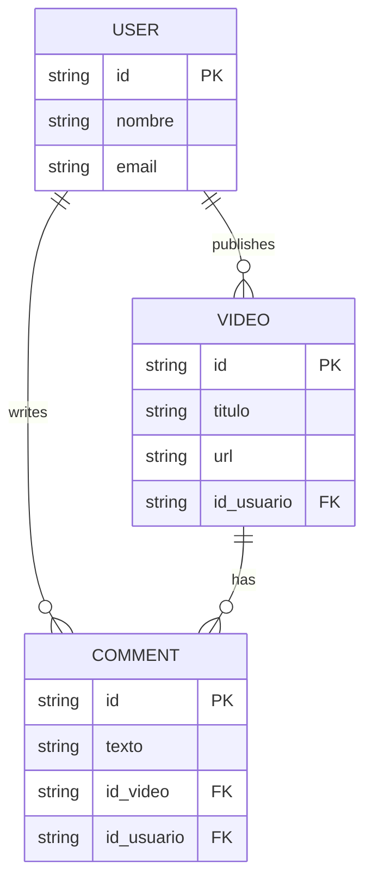

<p align="center">
  <a href="http://nestjs.com/" target="blank"></a>
</p>

[circleci-image]: https://img.shields.io/circleci/build/github/nestjs/nest/master?token=abc123def456
[circleci-url]: https://circleci.com/gh/nestjs/nest

<p align="center">A progressive <a href="http://nodejs.org" target="_blank">Node.js</a> framework for building efficient and scalable server-side applications.</p>
<p align="center">
<a href="https://www.npmjs.com/~nestjscore" target="_blank"></a>
<a href="https://www.npmjs.com/~nestjscore" target="_blank"></a>
<a href="https://www.npmjs.com/~nestjscore" target="_blank"></a>
<a href="https://circleci.com/gh/nestjs/nest" target="_blank"></a>
<a href="https://coveralls.io/github/nestjs/nest?branch=master" target="_blank"></a>
<a href="https://discord.gg/G7Qnnhy" target="_blank"></a>
</p>

## Descripción

Este es un proyecto basado en [Nest](https://github.com/nestjs/nest) que permite a los usuarios realizar comentarios en los vídeos publicados por otros usuarios. 

### Versiones utilizadas
- **Node.js**: v20.x
- **NestJS**: v10.x
- **TypeScript**: v5.x
- **MySql**: 

## Configuración del Proyecto

```bash
$ npm install
```

## Compilar y ejecutar el proyecto

```bash
# desarrollo
$ npm run start

# modo de vigilancia
$ npm run start:dev

# modo de producción
$ npm run start:prod
```

## Ejecutar pruebas

```bash
# pruebas unitarias
$ npm run test

# pruebas e2e
$ npm run test:e2e

# cobertura de pruebas
$ npm run test:cov
```

## Estructura de la Base de Datos

Las entidades involucradas en esta funcionalidad son:

- **Usuario (User)**:
  - `id`: Identificador único del usuario (PK).
  - `nombre`: Nombre del usuario.
  - `email`: Correo electrónico del usuario.

- **Vídeo (Video)**:
  - `id`: Identificador único del vídeo (PK).
  - `titulo`: Título del vídeo.
  - `url`: URL del vídeo.
  - `id_usuario`: Identificador del usuario que publicó el vídeo (FK).

- **Comentario (Comment)**:
  - `id`: Identificador único del comentario (PK).
  - `texto`: Texto del comentario.
  - `id_video`: Identificador del vídeo al que pertenece el comentario (FK).
  - `id_usuario`: Identificador del usuario que hizo el comentario (FK).

### Diagrama Entidad-Relación



## Documentación de Endpoints

Aquí puedes documentar los endpoints de tu API. Te recomiendo usar [Postman](https://www.postman.com/) o [ApiDog](https://apidog.com/) para crear la documentación.

```

### Notas

1. **Actualiza las versiones**: Asegúrate de actualizar las versiones de Node.js, NestJS y cualquier otra tecnología que estés utilizando en el proyecto.

2. **Información de contacto**: Cambia la información de contacto y enlaces donde sea necesario.

3. **Documentación de Endpoints**: Asegúrate de incluir la documentación de los endpoints en la sección correspondiente, ya sea usando Postman o ApiDog.

4. **Instrucciones de instalación**: Asegúrate de que las instrucciones de instalación y uso sean claras para facilitar la implementación.

Este README debería proporcionar una buena base para tu proyecto y facilitar la comprensión a otros desarrolladores sobre cómo utilizar y contribuir al mismo.